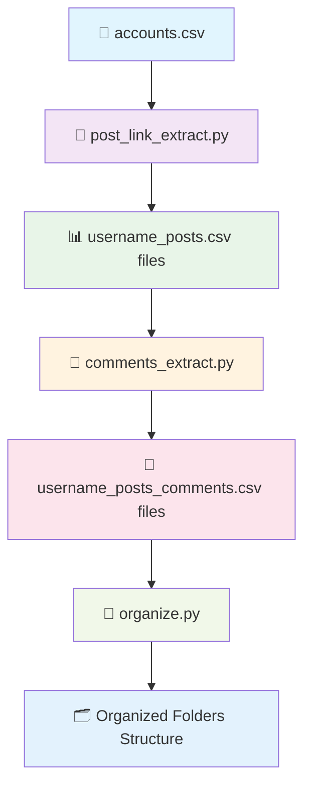

# 📸 Instagram Data Extraction & Organization Tool

A comprehensive tool for extracting Instagram posts and comments data, then organizing them into structured folders by user. This tool is designed for data analysis and research purposes.

## ⚠️ Important Disclaimer

**Account Management Required**: This tool does **NOT** use proxies or advanced rotation mechanisms. You'll need to manually manage multiple Instagram accounts and rotate them to avoid rate limiting. Each account typically takes **30-60 minutes** for post extraction and **longer for comment extraction** due to Instagram's rate limits.

---

## 🏗️ Project Architecture



## 📂 Project Structure

```
instagram-scraper/
├── 📄 post_link_extract.py          # Extracts post links into CSV
├── 📄 comments_extract.py           # Extracts comments data into CSV  
├── 📄 organize.py                   # Organizes CSV files into folders
├── 📄 requirements.txt              # Python dependencies
├── 📄 accounts.csv                  # Target usernames list
├── 📄 .env                         # Scraper account credentials
├── 📁 docs/                        # Documentation files
│   ├── 📄 post_link_extract.md     # Post extraction guide
│   ├── 📄 comments_extract.md      # Comments extraction guide
│   └── 📄 organize.md              # Organization guide
└── 📁 organized_folder/            # Output folder (auto-created)
    ├── 📂 user1/
    ├── 📂 user2/
    └── 📂 user3/
```

---

## 🚀 Quick Start Guide

### Step 1: Install Dependencies

Choose your operating system:

#### 🪟 Windows
```cmd
# Using Command Prompt
pip install -r requirements.txt

# Using PowerShell  
pip install -r requirements.txt
```

#### 🍎 macOS
```bash
# Using Terminal
pip3 install -r requirements.txt

# If you have Python installed via Homebrew
pip install -r requirements.txt
```

#### 🐧 Linux (Ubuntu/Debian)
```bash
# Using apt package manager
sudo apt update
sudo apt install python3-pip
pip3 install -r requirements.txt

# For CentOS/RHEL
sudo yum install python3-pip
pip3 install -r requirements.txt
```

### Step 2: Setup Configuration Files

1. **Create accounts.csv** - List of Instagram usernames to scrape:
   ```csv
   username
   example_user1
   example_user2
   example_user3
   ```

2. **Create .env file** - Your scraper account credentials:
   ```env
   scraper accounts=[
       {"username": "your_account1", "password": "password1"},
       {"username": "your_account2", "password": "password2"}
   ]
   ```

### Step 3: Run the Extraction Process

#### 🪟 Windows

```cmd
# Step 1: Extract post links
python post_link_extract.py

# Step 2: Extract comments (after post extraction completes)
python comments_extract.py  

# Step 3: Organize files into folders
python organize.py
```

#### 🍎 macOS

```bash
# Step 1: Extract post links
python3 post_link_extract.py

# Step 2: Extract comments (after post extraction completes)  
python3 comments_extract.py

# Step 3: Organize files into folders
python3 organize.py
```

#### 🐧 Linux

```bash
# Step 1: Extract post links
python3 post_link_extract.py

# Step 2: Extract comments (after post extraction completes)
python3 comments_extract.py

# Step 3: Organize files into folders  
python3 organize.py
```

---

## 📖 Detailed Documentation

For comprehensive guides on each component:

- **[📄 Post Link Extraction Guide](docs/post_link_extract.md)** - Detailed instructions for extracting Instagram post links
- **[📄 Comments Extraction Guide](docs/comments_extract.md)** - Complete guide for extracting comments and replies
- **[📄 File Organization Guide](docs/organize.md)** - Instructions for organizing extracted data

---

## ⏱️ Expected Processing Times

| Process | Time per Account | Notes |
|---------|-----------------|--------|
| **Post Links** | 30-60 minutes | Depends on post count |
| **Comments** | 1-2 hours | Significantly longer due to API limits |
| **Organization** | 1-2 minutes | Fast local file operations |

> **💡 Pro Tip**: Run post extraction for all accounts first, then run comment extraction overnight for best results.

---

## 📁 Output Structure

After running the complete workflow, your files will be organized as follows:

```
organized_folder/
│
├── 📂 user1/
│   ├── 📄 user1_posts.csv                    # Post links and metadata
│   └── 📄 user1_posts_comments.csv           # Comments and replies
│
├── 📂 user2/  
│   ├── 📄 user2_posts.csv
│   └── 📄 user2_posts_comments.csv
│
├── 📂 user3/
│   ├── 📄 user3_posts.csv  
│   └── 📄 user3_posts_comments.csv
│
└── ... (additional users)
```

---

## ⚙️ Configuration & Limitations

### 🔒 Account Management
- **No Proxy Support**: This tool operates without proxy rotation
- **Manual Account Switching**: You must rotate Instagram accounts manually  
- **Rate Limiting**: Instagram enforces strict rate limits - expect delays
- **Account Safety**: Use dedicated accounts, not your personal ones

### 📊 Data Extraction Features
- ✅ Post links and metadata
- ✅ Comment text and timestamps  
- ✅ Reply threads with parent tracking
- ✅ Like counts and engagement metrics
- ✅ Resume capability with checkpoints
- ✅ Progress tracking with visual indicators

### 🛠️ System Requirements
- **Python**: 3.7 or higher
- **RAM**: 4GB minimum (8GB recommended)
- **Storage**: Varies by data volume
- **Network**: Stable internet connection required

---

## 🔧 Troubleshooting

### Common Issues

**Login Failed**  
- Verify credentials in `.env` file
- Check if account is temporarily blocked
- Try using a different account

**CSV File Not Found**  
- Ensure `accounts.csv` exists in the project directory
- Check file format and column headers

**Rate Limited**  
- Wait 1-2 hours before retrying
- Switch to a different scraper account
- Reduce processing speed in configuration

---

## 📄 License

This tool is for educational and research purposes only. Please comply with Instagram's Terms of Service and respect user privacy.

---

## 🤝 Contributing

Feel free to submit issues and enhancement requests!

---

