# 🏗️ System Architecture & Communication Flow

A comprehensive breakdown of how the Instagram Data Extraction Tool components interact with each other and communicate with Instagram's infrastructure.

---

## 🌐 High-Level System Overview


---

## 🔧 Component Communication Matrix

| Component | Reads From | Writes To | Communicates With |
|-----------|------------|-----------|-------------------|
| **post_link_extract.py** | accounts.csv, .env, checkpoints | {username}_posts.csv, checkpoints | Instagram GraphQL API |
| **comments_extract.py** | {username}_posts.csv, .env | {username}_posts_comments.csv | Instagram GraphQL API |
| **organize.py** | accounts.csv, all CSV files | organized_folder/ structure | Local file system |
| **Checkpoint System** | Previous state files | Updated state files | All main components |

---

## 🚀 post_link_extract.py - Deep Dive Architecture

### 🔄 Internal Function Flow

```mermaid
graph TD
    A[🚀 Main Entry Point] --> B[📖 Load Configuration]
    B --> C[🔍 Load Checkpoints]
    C --> D[📋 Read Target Usernames]
    D --> E[⚡ Initialize Multiprocessing]
    
    E --> F[🔀 Split Usernames into Chunks]
    F --> G[👥 Assign Scraper Accounts]
    G --> H[🏃 Launch Parallel Workers]
    
    H --> I[📱 Worker Process Start]
    I --> J{🔐 Account Blocked?}
    J -->|Yes| K[⏭️ Skip to Next Account]
    J -->|No| L[🎯 Login to Instagram]
    
    L --> M{✅ Login Success?}
    M -->|No| N[💾 Mark Account as Blocked]
    M -->|Yes| O[👤 Load Target Profile]
    
    O --> P{📊 Profile Found?}
    P -->|No| Q[❌ Log Profile Error]
    P -->|Yes| R[📈 Get Post Count]
    
    R --> S[📄 Check Existing CSV]
    S --> T[🔍 Load Existing Shortcodes]
    T --> U[🔄 Start Post Iteration]
    
    U --> V{📝 New Post?}
    V -->|No| W[⏭️ Skip to Next Post]
    V -->|Yes| X[📊 Extract Post Data]
    
    X --> Y[💾 Write to CSV]
    Y --> Z[⏰ Apply Rate Limiting]
    Z --> AA{🎯 More Posts?}
    
    AA -->|Yes| V
    AA -->|No| BB[💾 Save Progress]
    BB --> CC[✅ Mark User Complete]
    CC --> DD[🏁 Worker Complete]
    
    N --> K
    Q --> K
    K --> DD
    W --> AA
    
    
```

### 🔐 Authentication Flow

```mermaid
sequenceDiagram
    participant S as Scraper Account
    participant IL as Instaloader
    participant IG as Instagram Server
    participant CF as Checkpoint File
    
    S->>IL: Initialize with credentials
    IL->>IG: POST /accounts/login/
    Note over IG: User-Agent: Mobile Safari
    
    alt Successful Login
        IG-->>IL: Session cookies + CSRF token
        IL-->>S: ✅ Authentication success
        S->>S: Proceed with scraping
    else Failed Login
        IG-->>IL: Challenge required / Rate limited
        IL-->>S: ❌ Authentication failed
        S->>CF: Mark account as blocked
        S->>S: Switch to next account
    end
```

### 📊 Data Extraction Process

```mermaid
graph LR
    subgraph "Instagram Profile"
        A[👤 Profile Object]
        B[📊 Metadata<br/>Post Count, Bio, etc.]
        C[🔗 Posts Iterator]
    end
    
    subgraph "Post Processing"
        D[📝 Individual Post]
        E[🏷️ Extract Shortcode]
        F[📅 Extract Timestamp]
        G[❤️ Extract Likes]
        H[💬 Extract Comments Count]
        I[🎥 Detect Post Type]
    end
    
    subgraph "Output Generation"
        J[📋 CSV Row Creation]
        K[💾 Write to File]
        L[🔄 Checkpoint Update]
    end
    
    A --> B
    A --> C
    C --> D
    D --> E
    D --> F
    D --> G
    D --> H
    D --> I
    
    E --> J
    F --> J
    G --> J
    H --> J
    I --> J
    
    J --> K
    K --> L
    
    
```

---

## 💬 comments_extract.py - Deep Dive Architecture

### 🔄 Comment Extraction Flow

```mermaid
graph TD
    A[🚀 Start Comment Extraction] --> B[📖 Read Posts CSV]
    B --> C[🔍 Load Existing Comments]
    C --> D[🔐 Login with Scraper Account]
    
    D --> E{✅ Login Success?}
    E -->|No| F[⚠️ Switch Account]
    E -->|Yes| G[🔄 Iterate Through Posts]
    
    G --> H[📝 Load Post by Shortcode]
    H --> I{📊 Post Accessible?}
    I -->|No| J[⏭️ Skip to Next Post]
    I -->|Yes| K[💬 Get Comments Iterator]
    
    K --> L[🔄 Process Each Comment]
    L --> M[📝 Extract Comment Data]
    M --> N{🔗 Has Replies?}
    
    N -->|Yes| O[🔄 Process Reply Thread]
    N -->|No| P[💾 Write Comment to CSV]
    
    O --> Q[📝 Extract Reply Data]
    Q --> R[🔗 Link to Parent Comment]
    R --> S[💾 Write Reply to CSV]
    
    P --> T[⏰ Apply Rate Limiting]
    S --> T
    T --> U{📊 More Comments?}
    
    U -->|Yes| L
    U -->|No| V{🎯 More Posts?}
    V -->|Yes| H
    V -->|No| W[✅ Extraction Complete]
    
    F --> D
    J --> V
    
    
```

### 🌐 Instagram GraphQL Communication


### 📊 Comment Data Structure

```mermaid
graph TB
    subgraph "Comment Object"
        A[💬 Comment ID]
        B[👤 Author Username]
        C[📝 Comment Text]
        D[📅 Timestamp]
        E[❤️ Like Count]
        F[🔗 Parent Comment ID]
    end
    
    subgraph "Reply Thread Structure"
        G[📝 Root Comment<br/>parent_comment_id: null]
        H[📝 Reply Level 1<br/>parent_comment_id: root_id]
        I[📝 Reply Level 2<br/>parent_comment_id: level1_id]
        J[📝 Reply Level 3<br/>parent_comment_id: level2_id]
    end
    
    subgraph "CSV Output Format"
        K[📊 Flat Structure<br/>All comments + replies]
        L[🔗 Parent-Child Relationships<br/>Maintained via IDs]
    end
    
    A --> G
    B --> G
    C --> G
    D --> G
    E --> G
    F --> G
    
    G --> H
    H --> I
    I --> J
    
    G --> K
    H --> K
    I --> K
    J --> K
    
    F --> L
    
    
```

---

## 📁 organize.py - File Management Architecture

### 🔄 Organization Process Flow

```mermaid
graph TD
    A[🚀 Start Organization] --> B[📖 Read accounts.csv]
    B --> C[📂 Get Source Directory Path]
    C --> D[📁 Create organized_folder/]
    D --> E[📋 List All CSV Files]
    
    E --> F[🔄 For Each Username]
    F --> G[🔍 Scan Files for Username Match]
    G --> H{📝 Username in Filename?}
    
    H -->|No| I[⏭️ Skip File]
    H -->|Yes| J[📂 Create User Directory]
    
    J --> K[✂️ Move File to User Folder]
    K --> L[📝 Log Move Operation]
    L --> M{📊 More Files?}
    
    M -->|Yes| G
    M -->|No| N{👥 More Users?}
    N -->|Yes| F
    N -->|No| O[✅ Organization Complete]
    
    I --> M
    
    
```

### 📂 File System Operations

```mermaid
graph LR
    subgraph "Source Directory"
        A[📄 user1_posts.csv]
        B[📄 user1_posts_comments.csv]
        C[📄 user2_posts.csv]
        D[📄 user2_posts_comments.csv]
        E[📄 accounts.csv]
        F[📄 other_files.txt]
    end
    
    subgraph "Pattern Matching Engine"
        G[🔍 Username Extraction]
        H[📝 File Filtering]
        I[🎯 Match Algorithm]
    end
    
    subgraph "Target Structure"
        J[📂 organized_folder/]
        K[📂 user1/]
        L[📂 user2/]
        M[📄 user1_posts.csv]
        N[📄 user1_posts_comments.csv]
        O[📄 user2_posts.csv]
        P[📄 user2_posts_comments.csv]
    end
    
    A --> G
    B --> G
    C --> G
    D --> G
    
    G --> H
    H --> I
    I --> J
    
    J --> K
    J --> L
    K --> M
    K --> N
    L --> O
    L --> P
    
    E -.-> E
    F -.-> F
    
    
```

---

## 🌐 Instagram API Communication Deep Dive

### 🔐 Authentication & Session Management


### 📡 GraphQL Query Structure

```mermaid
graph TB
    subgraph "Query Types"
        A[🏠 ProfilePageQuery<br/>Basic profile info]
        B[📊 ProfilePostsQuery<br/>Post metadata batch]
        C[💬 CommentsByMediaId<br/>Comments for specific post]
        D[🔄 CommentRepliesQuery<br/>Reply threads]
    end
    
    subgraph "Request Headers"
        E[🔑 X-CSRFToken]
        F[🍪 sessionid cookie]
        G[📱 User-Agent: Mobile Safari]
        H[📝 Content-Type: application/json]
    end
    
    subgraph "Response Structure"
        I[📦 JSON Response]
        J[📊 Data Object]
        K[⚠️ Extensions Object]
        L[❌ Errors Array]
    end
    
    subgraph "Rate Limiting"
        M[⏰ Request Throttling]
        N[📊 Response Size Limits]
        O[🚫 IP-based Blocking]
        P[👤 Account-based Limits]
    end
    
    A --> E
    B --> F
    C --> G
    D --> H
    
    E --> I
    F --> J
    G --> K
    H --> L
    
    I --> M
    J --> N
    K --> O
    L --> P
    
    
```

### 🛡️ Anti-Detection Mechanisms

```mermaid
graph TD
    subgraph "Rate Limiting Strategy"
        A[⏰ Base Delay: 1-3 seconds]
        B[🎯 Every 20 posts: 20-40 sec pause]
        C[🔄 Random intervals]
        D[📊 Exponential backoff on errors]
    end
    
    subgraph "Request Variation"
        E[📱 Mobile User-Agent rotation]
        F[🔀 Header randomization]
        G[⏰ Timestamp variation]
        H[🎲 Request ordering shuffle]
    end
    
    subgraph "Session Management"
        I[🍪 Cookie persistence]
        J[🔑 CSRF token refresh]
        K[⚡ Connection reuse]
        L[🔒 SSL certificate validation]
    end
    
    subgraph "Error Handling"
        M[🔄 Retry logic]
        N[👥 Account switching]
        O[💾 Progress checkpointing]
        P[📈 Success rate monitoring]
    end
    
    A --> M
    B --> N
    C --> O
    D --> P
    
    E --> I
    F --> J
    G --> K
    H --> L
    
    
```

---

## 💾 Data Flow & Storage Architecture

### 📊 CSV Data Structure Evolution

```mermaid
graph LR
    subgraph "Posts CSV Structure"
        A[📝 Type: Post/Reel]
        B[🔗 URL: Instagram link]
        C[📅 Timestamp: UTC format]
        D[🏷️ Shortcode: Unique ID]
        E[❤️ Likes: Engagement count]
        F[💬 Comments: Comment count]
    end
    
    subgraph "Comments CSV Structure"
        G[💬 comment_id: Unique identifier]
        H[👤 username: Comment author]
        I[📝 comment_text: Message content]
        J[📅 timestamp: Comment time]
        K[❤️ likes: Comment likes]
        L[🔗 parent_comment_id: Thread structure]
        M[🎯 post_shortcode: Link to post]
    end
    
    subgraph "Processing Pipeline"
        N[🔄 Raw Instagram Data]
        O[🧹 Data Cleaning]
        P[📊 Structure Validation]
        Q[💾 CSV Writing]
        R[🔍 Duplicate Detection]
    end
    
    A --> N
    B --> N
    C --> N
    D --> N
    E --> N
    F --> N
    
    G --> N
    H --> N
    I --> N
    J --> N
    K --> N
    L --> N
    M --> N
    
    N --> O
    O --> P
    P --> Q
    Q --> R
    
    
```

### 🗂️ File Organization Hierarchy

```mermaid
graph TB
    subgraph "Input Files"
        A[📄 accounts.csv<br/>Target list]
        B[📊 user1_posts.csv<br/>Post data]
        C[💭 user1_posts_comments.csv<br/>Comment data]
        D[📊 user2_posts.csv<br/>Post data]
        E[💭 user2_posts_comments.csv<br/>Comment data]
    end
    
    subgraph "Organization Algorithm"
        F[🔍 Username Pattern Matching]
        G[📂 Directory Creation]
        H[✂️ File Movement]
        I[📝 Operation Logging]
    end
    
    subgraph "Output Structure"
        J[📁 organized_folder/]
        K[📂 user1/]
        L[📂 user2/]
        M[📊 Posts CSV]
        N[💭 Comments CSV]
        O[📊 Posts CSV]
        P[💭 Comments CSV]
    end
    
    A --> F
    B --> F
    C --> F
    D --> F
    E --> F
    
    F --> G
    G --> H
    H --> I
    
    I --> J
    J --> K
    J --> L
    K --> M
    K --> N
    L --> O
    L --> P
    
    
```

---

## 🔄 Checkpoint & Recovery System

### 💾 State Management Architecture

```mermaid
graph TD
    subgraph "Checkpoint Files"
        A[🔄 account_checkpoint.json<br/>Blocked accounts list]
        B[✅ target_checkpoint.json<br/>Completed users list]
        C[📈 accounts_summary.csv<br/>Statistics overview]
    end
    
    subgraph "Recovery Mechanisms"
        D[🔍 Existing File Detection]
        E[📊 Progress Calculation]
        F[⏭️ Skip Completed Items]
        G[🔄 Resume from Last Point]
    end
    
    subgraph "State Updates"
        H[💾 Real-time Saving]
        I[🔒 Atomic Operations]
        J[✅ Validation Checks]
        K[🔄 Rollback Capability]
    end
    
    A --> D
    B --> D
    C --> D
    
    D --> E
    E --> F
    F --> G
    
    G --> H
    H --> I
    I --> J
    J --> K
    
    K --> A
    
    
```

### 🚨 Error Recovery Flow


---

## ⚡ Performance & Scalability Architecture

### 🏃 Multi-Processing Design

```mermaid
graph TB
    subgraph "Main Process"
        A[🚀 Main Controller]
        B[📋 Username Distribution]
        C[👥 Account Assignment]
        D[📊 Progress Aggregation]
    end
    
    subgraph "Worker Processes"
        E[👤 Worker 1<br/>Account A]
        F[👤 Worker 2<br/>Account B]
        G[👤 Worker 3<br/>Account C]
        H[👤 Worker N<br/>Account N]
    end
    
    subgraph "Instagram Endpoints"
        I[🌐 Instagram Server 1]
        J[🌐 Instagram Server 2]
        K[🌐 Instagram Server 3]
        L[🌐 Instagram Server N]
    end
    
    subgraph "Output Generation"
        M[📊 CSV Files]
        N[💾 Checkpoint Files]
        O[📈 Progress Reports]
    end
    
    A --> B
    B --> C
    C --> E
    C --> F
    C --> G
    C --> H
    
    E --> I
    F --> J
    G --> K
    H --> L
    
    I --> M
    J --> M
    K --> M
    L --> M
    
    E --> N
    F --> N
    G --> N
    H --> N
    
    D --> O
    
    
```

### 📈 Resource Utilization Patterns

```mermaid
graph LR
    subgraph "Memory Usage"
        A[📊 Low Base Usage<br/>~50MB per process]
        B[📈 Scaling Factor<br/>+10MB per 1000 posts]
        C[💾 Checkpoint Storage<br/>~1MB per account]
    end
    
    subgraph "Network Patterns"
        D[🌐 Concurrent Connections<br/>1 per worker process]
        E[📡 Request Rate<br/>1-3 requests/minute]
        F[📦 Data Transfer<br/>~10KB per post]
    end
    
    subgraph "Disk Operations"
        G[💾 Sequential Writes<br/>CSV append operations]
        H[🔄 Checkpoint Updates<br/>JSON file modifications]
        I[📂 File Organization<br/>Move operations]
    end
    
    A --> D
    B --> E
    C --> F
    
    D --> G
    E --> H
    F --> I
    
    
```

---

## 🔒 Security & Safety Measures

### 🛡️ Account Protection Strategy

```mermaid
graph TD
    subgraph "Authentication Safety"
        A[🔐 Credential Isolation<br/>.env file separation]
        B[🍪 Session Management<br/>Automatic cookie handling]
        C[🔄 Account Rotation<br/>Distribute load]
        D[⏰ Rate Limiting<br/>Respect API limits]
    end
    
    subgraph "Detection Avoidance"
        E[📱 Mobile User-Agent<br/>Mimic mobile app]
        F[🎲 Random Delays<br/>Human-like timing]
        G[🔀 Request Variation<br/>Avoid patterns]
        H[💤 Pause Mechanisms<br/>Cooling off periods]
    end
    
    subgraph "Error Recovery"
        I[🚨 Block Detection<br/>Monitor failed requests]
        J[👥 Account Switching<br/>Failover mechanism]
        K[💾 Progress Preservation<br/>Never lose work]
        L[🔄 Resume Capability<br/>Restart safely]
    end
    
    A --> E
    B --> F
    C --> G
    D --> H
    
    E --> I
    F --> J
    G --> K
    H --> L
    
    
```

---

## 📊 Monitoring & Analytics

### 📈 Progress Tracking System

```mermaid
graph LR
    subgraph "Real-time Metrics"
        A[⏳ Progress Bars<br/>Visual completion status]
        B[📊 Post Counters<br/>Current/Total posts]
        C[✨ New Item Tracking<br/>Recently processed]
        D[⚡ Processing Speed<br/>Items per minute]
    end
    
    subgraph "Historical Data"
        E[📈 accounts_summary.csv<br/>Account statistics]
        F[🔄 Checkpoint History<br/>Progress over time]
        G[❌ Error Logs<br/>Failure patterns]
        H[⏰ Timing Data<br/>Performance metrics]
    end
    
    subgraph "Health Indicators"
        I[✅ Success Rate<br/>Completed vs failed]
        J[🚫 Block Rate<br/>Account blocking frequency]
        K[🔄 Retry Statistics<br/>Recovery success]
        L[📊 Data Quality<br/>Missing fields analysis]
    end
    
    A --> E
    B --> F
    C --> G
    D --> H
    
    E --> I
    F --> J
    G --> K
    H --> L
    
    
```

---

## 🎯 Integration Points & Dependencies

### 📦 Library Integration Map

```mermaid
graph TB
    subgraph "Core Dependencies"
        A[📚 instaloader<br/>Instagram API wrapper]
        B[📊 pandas<br/>CSV data manipulation]
        C[🔄 multiprocessing<br/>Parallel execution]
        D[⚙️ python-dotenv<br/>Configuration management]
    end
    
    subgraph "System Libraries"
        E[🗂️ os/shutil<br/>File system operations]
        F[⏰ time/random<br/>Timing and randomization]
        G[🔤 json/csv<br/>Data serialization]
        H[📡 sys<br/>System interface]
    end
    
    subgraph "External Services"
        I[🌍 Instagram GraphQL API<br/>Data source]
        J[🔒 Instagram Auth System<br/>Authentication]
        K[📱 Instagram Web Interface<br/>Session management]
        L[🌐 CDN/Media Servers<br/>Content delivery]
    end
    
    A --> I
    A --> J
    A --> K
    B --> G
    C --> H
    D --> E
    
    E --> L
    F --> A
    G --> B
    H --> C
    
    
```

---

## 🔬 Data Processing Pipeline Deep Dive

### 🧬 Data Transformation Flow

```mermaid
graph TD
    subgraph "Raw Data Extraction"
        A[📡 Instagram API Response<br/>JSON format]
        B[🏷️ Metadata Extraction<br/>Timestamps, IDs, counts]
        C[🧹 Data Cleaning<br/>Remove null values]
        D[🔍 Validation Checks<br/>Required fields present]
    end
    
    subgraph "Structural Processing"
        E[📊 Post Data Flattening<br/>Nested objects to columns]
        F[🔗 URL Generation<br/>Shortcode to Instagram link]
        G[📅 Timestamp Normalization<br/>UTC format standardization]
        H[🎯 Type Classification<br/>Post vs Reel detection]
    end
    
    subgraph "Comment Threading"
        I[💬 Comment Hierarchy<br/>Parent-child relationships]
        J[🔄 Reply Chain Processing<br/>Recursive thread traversal]
        K[🆔 ID Assignment<br/>Unique identifier generation]
        L[🔗 Cross-referencing<br/>Link comments to posts]
    end
    
    subgraph "Output Formatting"
        M[📋 CSV Row Assembly<br/>Column mapping]
        N[🔤 Text Encoding<br/>UTF-8 compliance]
        O[📊 Data Type Casting<br/>String/integer formatting]
        P[💾 File Writing<br/>Atomic operations]
    end
    
    A --> B
    B --> C
    C --> D
    D --> E
    
    E --> F
    F --> G
    G --> H
    H --> I
    
    I --> J
    J --> K
    K --> L
    L --> M
    
    M --> N
    N --> O
    O --> P
    
    
```

### 🔄 Memory Management Strategy

```mermaid
graph LR
    subgraph "Memory Allocation"
        A[📦 Data Buffers<br/>Fixed-size chunks]
        B[🔄 Iterator Pattern<br/>Lazy evaluation]
        C[♻️ Object Recycling<br/>Reuse instances]
        D[🧹 Garbage Collection<br/>Automatic cleanup]
    end
    
    subgraph "Performance Optimization"
        E[📊 Batch Processing<br/>Process multiple items]
        F[⚡ Async Operations<br/>Non-blocking I/O]
        G[💾 Streaming Writes<br/>Direct to disk]
        H[🔍 Early Filtering<br/>Skip unnecessary data]
    end
    
    subgraph "Resource Monitoring"
        I[📈 Memory Usage Tracking<br/>Monitor consumption]
        J[⚠️ Threshold Alerts<br/>Prevent overflow]
        K[🔄 Automatic Cleanup<br/>Free unused resources]
        L[📊 Performance Metrics<br/>Optimize bottlenecks]
    end
    
    A --> E
    B --> F
    C --> G
    D --> H
    
    E --> I
    F --> J
    G --> K
    H --> L
    
    
```

---

## 🌐 Network Communication Architecture

### 📡 HTTP Request/Response Cycle

```mermaid
sequenceDiagram
    participant App as Python Application
    participant IL as Instaloader Library
    participant Proxy as Connection Pool
    participant CDN as Instagram CDN
    participant API as GraphQL Endpoint
    participant Auth as Auth Server
    
    Note over App,Auth: Session Establishment
    App->>IL: Initialize session
    IL->>Proxy: Create connection pool
    IL->>Auth: Authenticate with credentials
    Auth-->>IL: Session cookies + CSRF token
    IL-->>App: Authenticated session
    
    Note over App,Auth: Data Request Cycle
    loop For each data request
        App->>IL: Request user data
        IL->>IL: Add rate limiting delay
        IL->>Proxy: Prepare HTTP request
        Proxy->>API: POST /graphql/ with query
        
        alt Successful Response
            API->>CDN: Fetch media metadata
            CDN-->>API: Media information
            API-->>Proxy: JSON response with data
            Proxy-->>IL: HTTP 200 with content
            IL-->>App: Parsed data objects
            
        else Rate Limited
            API-->>Proxy: HTTP 429 Too Many Requests
            Proxy-->>IL: Rate limit response
            IL->>IL: Exponential backoff delay
            IL->>Proxy: Retry request
            
        else Authentication Error
            API-->>Proxy: HTTP 401/403 Unauthorized
            Proxy-->>IL: Auth failure response
            IL-->>App: Login required exception
            App->>App: Switch to backup account
            
        else Network Error
            Proxy-->>IL: Connection timeout/error
            IL->>IL: Retry with backoff
            IL->>Proxy: Retry request
        end
    end
```

### 🔗 Connection Pool Management

```mermaid
graph TB
    subgraph "Connection Pool"
        A[🏊 Pool Manager<br/>Max 10 connections]
        B[🔄 Connection Reuse<br/>HTTP Keep-Alive]
        C[⏰ Timeout Handling<br/>30-second limits]
        D[♻️ Connection Recycling<br/>Automatic cleanup]
    end
    
    subgraph "Request Queue"
        E[📋 Request Queue<br/>FIFO processing]
        F[🎯 Priority Handling<br/>Auth requests first]
        G[⚡ Batch Optimization<br/>Combine similar requests]
        H[🔄 Retry Logic<br/>Failed request handling]
    end
    
    subgraph "Response Processing"
        I[📦 Response Caching<br/>Temporary storage]
        J[🔍 Content Validation<br/>JSON parsing]
        K[📊 Data Extraction<br/>Field mapping]
        L[💾 Persistent Storage<br/>Write to CSV]
    end
    
    A --> E
    B --> F
    C --> G
    D --> H
    
    E --> I
    F --> J
    G --> K
    H --> L
    
    
```

---

## 🎮 User Interaction & Control Flow

### 🖥️ Command Line Interface

```mermaid
graph TD
    subgraph "User Input Phase"
        A[🚀 Script Launch<br/>python post_link_extract.py]
        B[📁 Path Input<br/>Enter CSV file path]
        C[✅ Validation<br/>Check file exists]
        D[📋 Configuration Load<br/>Read accounts.csv]
    end
    
    subgraph "Processing Phase"
        E[⚡ Multi-process Start<br/>Initialize workers]
        F[📊 Progress Display<br/>Real-time updates]
        G[⏰ Status Messages<br/>Login/error notifications]
        H[🎯 User Interaction<br/>Ctrl+C handling]
    end
    
    subgraph "Completion Phase"
        I[📈 Summary Report<br/>Files processed]
        J[💾 Checkpoint Save<br/>Final state storage]
        K[✅ Success Message<br/>Completion notification]
        L[🔗 Next Steps<br/>Guide to comments extraction]
    end
    
    A --> B
    B --> C
    C --> D
    D --> E
    
    E --> F
    F --> G
    G --> H
    H --> I
    
    I --> J
    J --> K
    K --> L
    
    
```

### 🎛️ Interactive Control Systems

```mermaid
graph LR
    subgraph "Real-time Feedback"
        A[📊 Progress Bars<br/>█████████░ 90%]
        B[📈 Speed Indicators<br/>15 posts/min]
        C[⚠️ Status Alerts<br/>Login failed warnings]
        D[✨ Success Counters<br/>New items processed]
    end
    
    subgraph "User Controls"
        E[⏹️ Graceful Stop<br/>Ctrl+C interrupt]
        F[🔄 Resume Capability<br/>Automatic restart]
        G[👥 Account Switching<br/>Manual failover]
        H[📝 Configuration<br/>Runtime adjustments]
    end
    
    subgraph "Error Handling"
        I[🚨 Error Messages<br/>Descriptive failures]
        J[🔧 Troubleshooting<br/>Suggested solutions]
        K[📋 Log Generation<br/>Debug information]
        L[🎯 Recovery Actions<br/>Automatic fixes]
    end
    
    A --> E
    B --> F
    C --> G
    D --> H
    
    E --> I
    F --> J
    G --> K
    H --> L
    
    
```

---

## 📊 Data Quality & Integrity Systems

### 🔍 Validation Pipeline

```mermaid
graph TD
    subgraph "Input Validation"
        A[📋 Schema Validation<br/>Required columns present]
        B[🔤 Data Type Checking<br/>String/integer formats]
        C[📏 Length Constraints<br/>Username/text limits]
        D[🚫 Null Value Detection<br/>Missing data handling]
    end
    
    subgraph "Content Validation"
        E[🔗 URL Verification<br/>Valid Instagram links]
        F[📅 Timestamp Format<br/>ISO 8601 compliance]
        G[🆔 Unique ID Checks<br/>Duplicate prevention]
        H[📊 Range Validation<br/>Reasonable numeric values]
    end
    
    subgraph "Integrity Checks"
        I[🔗 Relationship Validation<br/>Comments link to posts]
        J[🏷️ Cross-reference Checks<br/>Shortcode consistency]
        K[📈 Completeness Analysis<br/>Missing data reporting]
        L[✅ Final Verification<br/>Output quality assurance]
    end
    
    A --> E
    B --> F
    C --> G
    D --> H
    
    E --> I
    F --> J
    G --> K
    H --> L
    
    
```

### 🛡️ Error Detection & Correction

```mermaid
graph LR
    subgraph "Detection Methods"
        A[🔍 Pattern Recognition<br/>Anomaly detection]
        B[📊 Statistical Analysis<br/>Outlier identification]
        C[🔄 Cross-validation<br/>Data consistency]
        D[⚠️ Exception Monitoring<br/>Runtime error tracking]
    end
    
    subgraph "Correction Strategies"
        E[🔧 Automatic Fixes<br/>Simple error correction]
        F[⏭️ Data Skipping<br/>Invalid record handling]
        G[🔄 Retry Mechanisms<br/>Transient error recovery]
        H[📝 Manual Review<br/>Complex issue flagging]
    end
    
    subgraph "Quality Assurance"
        I[📈 Quality Metrics<br/>Success rate tracking]
        J[📋 Error Reporting<br/>Issue categorization]
        K[🎯 Improvement Tracking<br/>Quality trends]
        L[✅ Acceptance Criteria<br/>Output standards]
    end
    
    A --> E
    B --> F
    C --> G
    D --> H
    
    E --> I
    F --> J
    G --> K
    H --> L
    
    
```

---

## 🚀 Deployment & Scalability Considerations

### 🏭 Production Architecture

```mermaid
graph TB
    subgraph "Development Environment"
        A[💻 Local Development<br/>Single machine setup]
        B[🧪 Testing Environment<br/>Small dataset validation]
        C[🔍 Debug Configuration<br/>Verbose logging]
    end
    
    subgraph "Production Environment"
        D[🏭 Server Deployment<br/>Dedicated hardware]
        E[📊 Monitoring Systems<br/>Performance tracking]
        F[🔄 Automated Scheduling<br/>Cron job management]
        G[💾 Backup Systems<br/>Data protection]
    end
    
    subgraph "Scaling Strategies"
        H[📈 Horizontal Scaling<br/>Multiple machines]
        I[⚡ Vertical Scaling<br/>More powerful hardware]
        J[🌍 Geographic Distribution<br/>Multiple data centers]
        K[☁️ Cloud Integration<br/>AWS/Azure deployment]
    end
    
    A --> D
    B --> E
    C --> F
    
    D --> H
    E --> I
    F --> J
    G --> K
    
    
```

### 📊 Performance Optimization Framework

```mermaid
graph LR
    subgraph "CPU Optimization"
        A[⚡ Multi-processing<br/>Parallel execution]
        B[🔄 Async Operations<br/>Non-blocking I/O]
        C[📦 Batch Processing<br/>Efficient algorithms]
        D[🎯 Code Profiling<br/>Bottleneck identification]
    end
    
    subgraph "Memory Optimization"
        E[📊 Streaming Processing<br/>Minimize RAM usage]
        F[♻️ Object Pooling<br/>Reduce allocations]
        G[🧹 Garbage Collection<br/>Memory cleanup]
        H[📈 Memory Monitoring<br/>Usage tracking]
    end
    
    subgraph "I/O Optimization"
        I[💾 Buffered Writing<br/>Reduce disk ops]
        J[🔗 Connection Pooling<br/>Reuse connections]
        K[📦 Data Compression<br/>Efficient storage]
        L[⚡ SSD Storage<br/>Fast access times]
    end
    
    A --> E
    B --> F
    C --> G
    D --> H
    
    E --> I
    F --> J
    G --> K
    H --> L
    
    
```

---

## 🔮 Future Enhancement Roadmap

### 🛠️ Planned Improvements

```mermaid
timeline
    title System Evolution Timeline
    
    section Phase 1: Current State
        Basic Extraction    : Multi-account support
                           : CSV output format
                           : Manual organization
    
    section Phase 2: Enhanced Automation
        Smart Scheduling    : Automatic retry logic
                           : Intelligent rate limiting
                           : Dynamic account rotation
    
    section Phase 3: Advanced Analytics
        Data Insights      : Sentiment analysis
                          : Engagement metrics
                          : Trend identification
    
    section Phase 4: Enterprise Features
        Cloud Integration  : AWS/Azure deployment
                          : API endpoints
                          : Real-time dashboards
    
    section Phase 5: AI Integration
        Machine Learning   : Content categorization
                          : Spam detection
                          : Predictive analytics
```

### 🎯 Architecture Extensions

```mermaid
graph TB
    subgraph "Current System"
        A[📊 CSV-based Storage]
        B[🔄 Sequential Processing]
        C[📁 Local File Organization]
    end
    
    subgraph "Enhanced Data Layer"
        D[🗄️ Database Integration<br/>PostgreSQL/MongoDB]
        E[📊 Data Warehousing<br/>Analytics optimization]
        F[🔍 Search Capabilities<br/>Full-text indexing]
    end
    
    subgraph "Advanced Processing"
        G[🤖 ML Pipeline<br/>Content analysis]
        H[📈 Real-time Analytics<br/>Live dashboards]
        I[🔔 Alert Systems<br/>Anomaly detection]
    end
    
    subgraph "Enterprise Features"
        J[🌐 Web Interface<br/>User-friendly GUI]
        K[📡 REST API<br/>Third-party integration]
        L[☁️ Cloud Deployment<br/>Scalable infrastructure]
    end
    
    A --> D
    B --> G
    C --> J
    
    D --> E
    E --> F
    G --> H
    H --> I
    
    J --> K
    K --> L
    
    
```

---

## 📚 Technical Specifications

### 🔧 System Requirements

| Component | Minimum | Recommended | Enterprise |
|-----------|---------|-------------|------------|
| **CPU** | 2 cores, 2.0 GHz | 4 cores, 3.0 GHz | 8+ cores, 3.5+ GHz |
| **RAM** | 4 GB | 8 GB | 16+ GB |
| **Storage** | 10 GB available | 100 GB SSD | 1+ TB NVMe SSD |
| **Network** | 10 Mbps stable | 50 Mbps | 100+ Mbps |
| **Python** | 3.7+ | 3.9+ | 3.11+ |

### 📊 Performance Benchmarks

```mermaid
xychart-beta
    title "Processing Performance by Account Size"
    x-axis "Account Size (Posts)" ["1K", "5K", "10K", "25K", "50K", "100K"]
    y-axis "Time (Minutes)" 0 300
    bar "Post Extraction" [15, 45, 90, 180, 300, 450]
    bar "Comment Extraction" [30, 120, 240, 480, 720, 1200]
    bar "Organization" [1, 2, 3, 5, 8, 15]
```

### 🔄 API Rate Limits

| Operation Type | Limit | Reset Period | Strategy |
|----------------|--------|--------------|----------|
| **Login Attempts** | 5 per account | 1 hour | Account rotation |
| **Profile Queries** | 60 per hour | Rolling hour | Distributed processing |
| **Post Requests** | 200 per hour | Rolling hour | Intelligent batching |
| **Comment Requests** | 100 per hour | Rolling hour | Longer delays |

---

## 🎓 Best Practices & Guidelines

### 🛡️ Security Best Practices

```mermaid
graph TD
    subgraph "Credential Management"
        A[🔐 Environment Variables<br/>Never hardcode passwords]
        B[🔒 Access Control<br/>Limit file permissions]
        C[🔄 Regular Rotation<br/>Change credentials often]
        D[📊 Audit Logging<br/>Track access attempts]
    end
    
    subgraph "Account Safety"
        E[👥 Dedicated Accounts<br/>Don't use personal]
        F[📱 Two-Factor Auth<br/>Enhanced security]
        G[🚫 Avoid Suspicious Patterns<br/>Vary request timing]
        H[⚠️ Monitor Block Status<br/>Check account health]
    end
    
    subgraph "Data Protection"
        I[💾 Regular Backups<br/>Protect extracted data]
        J[🔒 Encryption at Rest<br/>Secure storage]
        K[🌐 Secure Transmission<br/>HTTPS only]
        L[🗑️ Data Retention<br/>Clean old files]
    end
    
    A --> E
    B --> F
    C --> G
    D --> H
    
    E --> I
    F --> J
    G --> K
    H --> L
    
    
```

### 🎯 Operational Excellence

```mermaid
graph LR
    subgraph "Monitoring"
        A[📊 Performance Metrics<br/>Track processing speed]
        B[🚨 Error Alerts<br/>Immediate notification]
        C[📈 Trend Analysis<br/>Long-term patterns]
        D[🔍 Health Checks<br/>System status]
    end
    
    subgraph "Maintenance"
        E[🔄 Regular Updates<br/>Keep dependencies current]
        F[🧹 Cleanup Routines<br/>Remove old files]
        G[🔧 Performance Tuning<br/>Optimize bottlenecks]
        H[📋 Documentation<br/>Keep guides updated]
    end
    
    subgraph "Quality Assurance"
        I[✅ Data Validation<br/>Verify output quality]
        J[🧪 Testing Procedures<br/>Validate changes]
        K[📊 Quality Metrics<br/>Track improvements]
        L[🎯 Continuous Improvement<br/>Iterative enhancement]
    end
    
    A --> E
    B --> F
    C --> G
    D --> H
    
    E --> I
    F --> J
    G --> K
    H --> L
    
    
```

---

## 📝 Conclusion

This comprehensive system architecture demonstrates a sophisticated, multi-layered approach to Instagram data extraction that prioritizes:

- **🔒 Security**: Through careful credential management and detection avoidance
- **⚡ Performance**: Via parallel processing and intelligent rate limiting  
- **🛡️ Reliability**: With comprehensive error handling and recovery systems
- **📊 Quality**: Through extensive validation and integrity checking
- **🔄 Maintainability**: With modular design and clear separation of concerns

The system's architecture enables scalable, maintainable, and reliable data extraction while respecting Instagram's terms of service and implementing robust safety measures.

---

**Author**: Saad Makki  
**Email**: saadmakki116@gmail.com  
**Last Updated**: August 2025

---

## 🔗 Related Documentation

- [📄 Post Link Extraction Guide](post_link_extract.md)
- [💬 Comments Extraction Guide](comments_extract.md) 
- [📁 File Organization Guide](organize.md)
- [🚀 Quick Start Guide](../README.md)