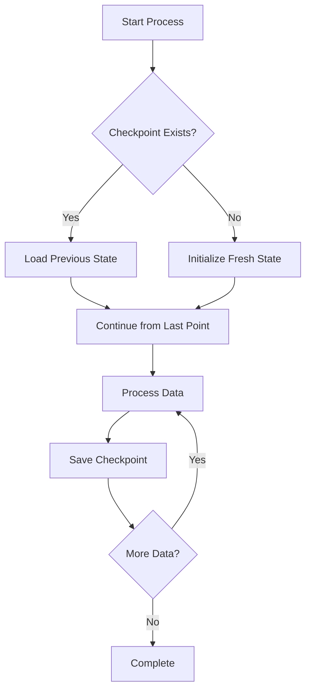

# 📊 Code Analysis: Variables, Objects & Programming Theories

## 🎯 Overview
This document provides a comprehensive analysis of the Instagram Data Extraction Tool, examining all variables, objects, and programming theories implemented across the three main scripts.

---

## 📝 Variables & Objects Analysis

### 🔗 post_link_extract.py

| Variable | Type | Purpose | Location | Theory Applied |
|----------|------|---------|----------|----------------|
| `SCRAPER_ACCOUNTS` | `list[dict]` | Store multiple Instagram login credentials | Global scope | **Environment Variable Pattern** - Secure credential management |
| `ACCOUNT_CHECKPOINT_FILE` | `str` | File path for account status persistence | Global scope | **Checkpoint Pattern** - Data persistence across sessions |
| `TARGET_CHECKPOINT_FILE` | `str` | File path for target completion tracking | Global scope | **State Management** - Progress tracking |
| `MAX_ATTEMPTS_PER_ACCOUNT` | `int` | Retry limit before marking account blocked | Global scope | **Circuit Breaker Pattern** - Failure handling |
| `POST_DELAY_RANGE` | `tuple` | Min/max seconds between post requests | Global scope | **Rate Limiting** - Anti-detection mechanism |
| `BIG_PAUSE_RANGE` | `tuple` | Extended pause duration range | Global scope | **Exponential Backoff** - Progressive delay strategy |
| `L` | `instaloader.Instaloader` | Instagram API client instance | Function scope | **Object Composition** - Third-party library integration |
| `profile` | `instaloader.Profile` | Instagram user profile object | Function scope | **Data Transfer Object (DTO)** - User data encapsulation |
| `existing_shortcodes` | `set` | Collection of processed post identifiers | Function scope | **Set Data Structure** - O(1) lookup for duplicates |
| `writer` | `csv.writer` | CSV file output handler | Function scope | **Writer Pattern** - Structured data output |

```python
# Example: Set data structure for efficient duplicate checking
existing_shortcodes = set()  # O(1) lookup time
if post.shortcode in existing_shortcodes:  # Constant time operation
    continue
```

### 📁 organize.py

| Variable | Type | Purpose | Location | Theory Applied |
|----------|------|---------|----------|----------------|
| `search_folder` | `str` | Source directory path for CSV files | Global scope | **Input Validation** - User-provided path handling |
| `folder_name` | `str` | Destination directory path construction | Global scope | **String Interpolation** - Dynamic path generation |
| `destination_folder` | `str` | Target location for organized files | Global scope | **Path Abstraction** - File system operations |
| `df` | `pandas.DataFrame` | Tabular data structure for accounts | Global scope | **Data Frame Pattern** - Structured data manipulation |
| `files` | `list` | Directory listing of available files | Global scope | **Directory Traversal** - File system exploration |
| `filepath` | `str` | Complete path to source file | Loop scope | **Path Resolution** - File location handling |
| `user_folder` | `str` | User-specific directory path | Loop scope | **Directory Creation Pattern** - Organized storage |
| `dest_path` | `str` | Final destination file path | Loop scope | **File Movement Pattern** - Data reorganization |

```python
# Example: DataFrame for structured data handling
df = pd.read_csv(account_name)  # Loads CSV into memory as structured data
for user in df["username"]:     # Iterates over specific column
```

---

## 🏗️ Object-Oriented Programming Concepts

### 📦 Encapsulation Examples

```python
# Instaloader object encapsulates Instagram API complexity
L = instaloader.Instaloader(
    sleep=True,                    # Internal rate limiting
    quiet=True,                    # Suppress verbose output
    user_agent="Mozilla/5.0...",   # Browser impersonation
    max_connection_attempts=1       # Connection retry logic
)
```

**Theory Applied**: **Encapsulation** - Complex Instagram API interactions are hidden behind a simple interface.

### 🔄 Inheritance & Composition

```python
# Profile inherits from base Instaloader classes
profile = instaloader.Profile.from_username(L.context, username)

# CSV writer composes file handling with formatting
with open(filename, mode, newline='', encoding='utf-8') as csvfile:
    writer = csv.writer(csvfile)  # Composition pattern
```

**Theory Applied**: **Composition over Inheritance** - Building complex functionality by combining simpler objects.

---

## 🔧 Programming Paradigms Implemented

### 1. **Functional Programming**

```python
# Pure function - same input always produces same output
def load_account_checkpoint():
    if os.path.exists(ACCOUNT_CHECKPOINT_FILE):
        try:
            with open(ACCOUNT_CHECKPOINT_FILE, 'r') as f:
                return json.load(f)
        except:
            return {"blocked": []}
    return {"blocked": []}
```

**Benefits**: 
- Predictable behavior
- Easy testing
- No side effects

### 2. **Procedural Programming**

```python
# Step-by-step execution in organize.py
search_folder = input("Enter the folder path...")  # Step 1
folder_name = f"{search_folder}/organized folder"  # Step 2
os.mkdir(folder_name)                              # Step 3
df = pd.read_csv(account_name)                     # Step 4
```

**Benefits**:
- Linear execution flow
- Easy to follow logic
- Clear sequence of operations

### 3. **Event-Driven Programming**

```python
# Exception handling drives program flow
try:
    L.login(scraper_account['username'], scraper_account['password'])
    print("✅ Login successful")
except Exception as e:
    print(f"⚠️ Login failed: {str(e)}")
    return None, "login_failed"
```

**Benefits**:
- Robust error handling
- Graceful failure recovery
- User-friendly feedback

---

## 🔄 Design Patterns Implemented

### 1. **Checkpoint Pattern** 🔄



**Implementation**:
```python
def load_target_checkpoint():
    if os.path.exists(TARGET_CHECKPOINT_FILE):
        try:
            with open(TARGET_CHECKPOINT_FILE, 'r') as f:
                return json.load(f)
        except:
            return {}
    return {}
```

**Benefits**:
- Resume interrupted processes
- Prevent data loss
- Efficient resource usage

### 2. **Circuit Breaker Pattern** ⚡

```python
# Prevents cascade failures when accounts get blocked
MAX_ATTEMPTS_PER_ACCOUNT = 2

if status == "blocked":
    account_checkpoint.setdefault("blocked", []).append(scraper_account['username'])
    save_account_checkpoint(account_checkpoint)
    break  # Stop using this account
```

**Theory**: Prevents system overload by failing fast when resources are unavailable.

### 3. **Strategy Pattern** 🎯

```python
# Different delay strategies based on context
time.sleep(random.uniform(*POST_DELAY_RANGE))        # Regular delay
if new_posts > 0 and new_posts % 20 == 0:
    time.sleep(random.uniform(*BIG_PAUSE_RANGE))     # Extended delay
```

**Theory**: Selects appropriate algorithm at runtime based on conditions.

### 4. **Factory Pattern** 🏭

```python
# Creates different types of objects based on input
L = instaloader.Instaloader(...)          # Creates scraper instance
profile = instaloader.Profile.from_username(L.context, username)  # Creates profile
```

**Theory**: Encapsulates object creation logic and provides a clean interface.

---

## 🔀 Control Flow Patterns

### 1. **Iterator Pattern**

```python
# Efficient traversal of large datasets
for post in profile.get_posts():  # Lazy evaluation - loads posts on demand
    if post.shortcode in existing_shortcodes:
        continue  # Skip already processed items
```

**Benefits**:
- Memory efficient
- Lazy loading
- Clean iteration syntax

### 2. **Guard Clause Pattern**

```python
# Early returns to reduce nesting
if post.shortcode in existing_shortcodes:
    continue  # Guard clause - exit early

if not os.path.exists(filepath):
    return  # Another guard clause
```

**Benefits**:
- Reduced complexity
- Improved readability
- Less nested code

---

## 📊 Data Structure Optimization

### **Set vs List Performance**

```python
# ❌ Inefficient O(n) lookup
existing_shortcodes = []  # List
if post.shortcode in existing_shortcodes:  # Linear search

# ✅ Efficient O(1) lookup  
existing_shortcodes = set()  # Set
if post.shortcode in existing_shortcodes:  # Constant time
```

### **Performance Comparison**

| Operation | List | Set |
|-----------|------|-----|
| Lookup | O(n) | O(1) |
| Insert | O(1) | O(1) |
| Memory | Lower | Higher |
| Duplicates | Allowed | Prevented |

---

## 🔧 Error Handling Strategies

### 1. **Graceful Degradation**

```python
try:
    profile = instaloader.Profile.from_username(L.context, username)
except Exception as e:
    print(f"❌ Profile error: {str(e)}")
    return None, "profile_error"  # Fail gracefully, don't crash
```

### 2. **Retry Mechanism**

```python
MAX_ATTEMPTS_PER_ACCOUNT = 2  # Built-in retry logic

# Implicit retry through account rotation
for scraper_account in available_accounts:
    result = try_scraping(scraper_account)
    if result.success:
        break  # Success, stop trying
```

### 3. **Fallback Values**

```python
# Provides default values when data is missing
likes=post.likes if post.likes else 0,        # Fallback to 0
comments=post.comments if post.comments else 0 # Fallback to 0
```

---

## 🎨 User Experience Patterns

### **Progress Visualization**

```python
# Real-time progress feedback
progress = min(100, int(post_count / total_posts * 100))
bar_length = 30
filled_length = int(bar_length * progress / 100)
bar = '█' * filled_length + '-' * (bar_length - filled_length)
sys.stdout.write(f"\r⏳ {username}: [{bar}] {progress}%")
```

**Visual Output**:
```
⏳ username: [██████████████████────] 75% | 📦 150/200 | ✨ New: 25
```

---

## 🔗 Documentation & Further Reading

### **Core Programming Concepts**
- [Python Official Documentation](https://docs.python.org/3/) - Complete Python language reference
- [Real Python - Object Oriented Programming](https://realpython.com/python3-object-oriented-programming/) - OOP concepts in Python
- [Python Design Patterns](https://python-patterns.guide/) - Comprehensive design patterns guide

### **Data Structures & Algorithms**
- [Python Data Structures](https://docs.python.org/3/tutorial/datastructures.html) - Built-in data structures
- [Big O Notation Guide](https://wiki.python.org/moin/TimeComplexity) - Algorithm complexity analysis
- [Pandas Documentation](https://pandas.pydata.org/docs/) - Data manipulation library

### **File Handling & I/O**
- [Python File I/O](https://docs.python.org/3/tutorial/inputoutput.html) - File operations
- [CSV Module Documentation](https://docs.python.org/3/library/csv.html) - CSV file handling
- [OS Module Documentation](https://docs.python.org/3/library/os.html) - Operating system interface

### **Error Handling & Debugging**
- [Python Exception Handling](https://docs.python.org/3/tutorial/errors.html) - Exception concepts
- [Logging Best Practices](https://docs.python.org/3/howto/logging.html) - Application logging
- [Debugging Techniques](https://realpython.com/python-debugging-pdb/) - Debugging strategies

### **Multiprocessing & Concurrency**
- [Python Multiprocessing](https://docs.python.org/3/library/multiprocessing.html) - Parallel processing
- [Concurrent Programming](https://realpython.com/python-concurrency/) - Concurrency patterns
- [Threading vs Multiprocessing](https://realpython.com/python-concurrency/#threading) - Choosing the right approach

### **Third-Party Libraries**
- [Instaloader Documentation](https://instaloader.github.io/) - Instagram data extraction
- [Pandas User Guide](https://pandas.pydata.org/pandas-docs/stable/user_guide/index.html) - Data analysis
- [Python-dotenv](https://pypi.org/project/python-dotenv/) - Environment variable management

### **Software Architecture**
- [Clean Code Principles](https://clean-code-developer.com/) - Code quality guidelines
- [SOLID Principles](https://realpython.com/solid-principles-python/) - Object-oriented design principles
- [Design Patterns in Python](https://refactoring.guru/design-patterns/python) - Common design patterns

---

**Author**: Saad Makki  
**Email**: saadmakki116@gmail.com  
**Date**: August 2025